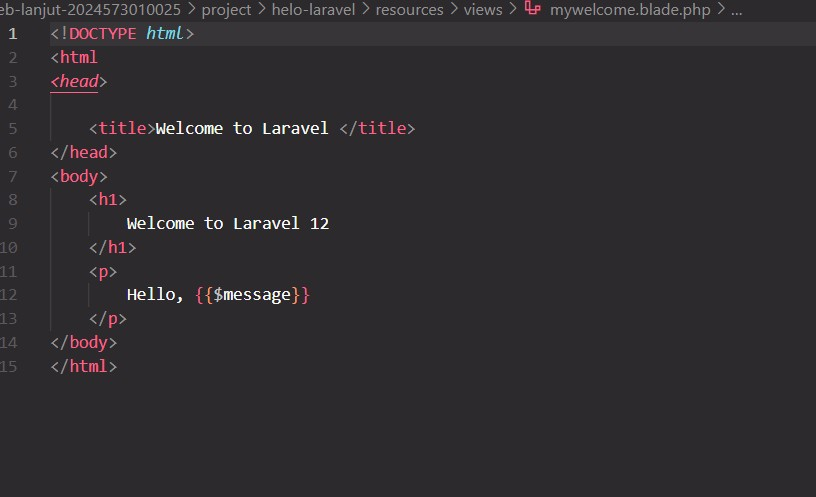
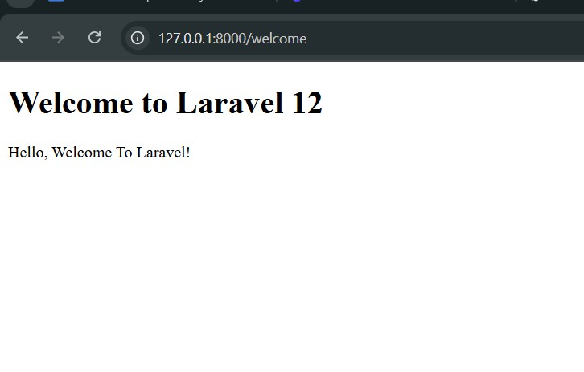
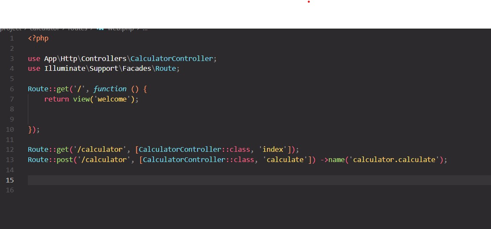
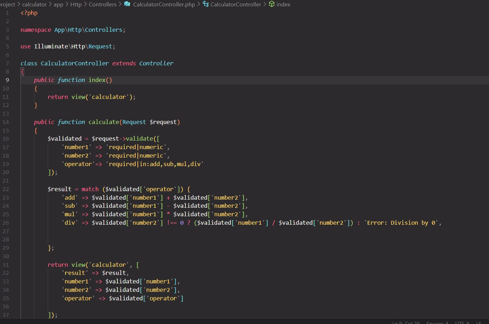
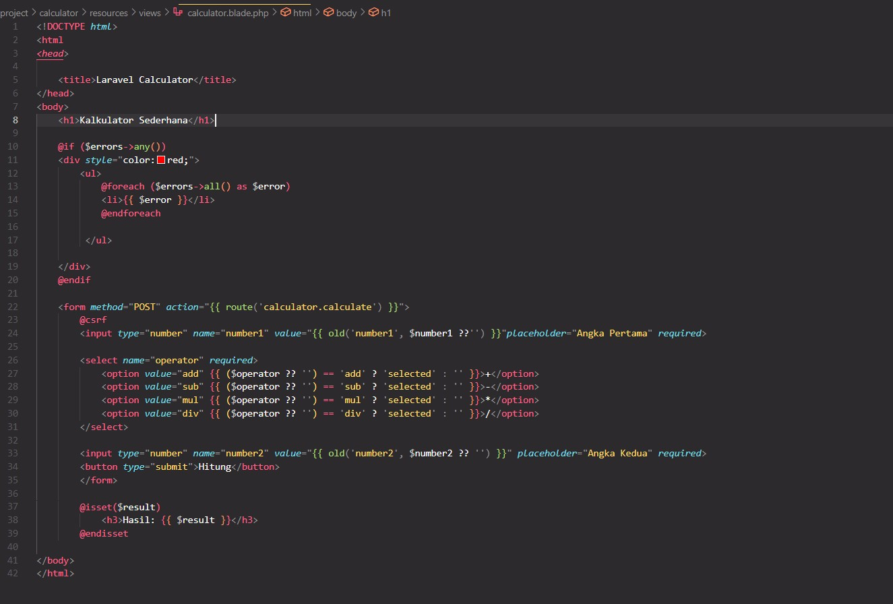
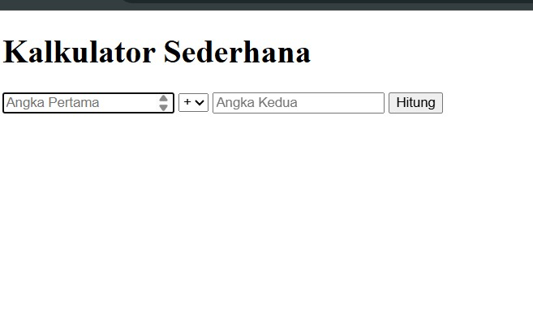
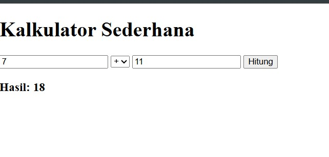
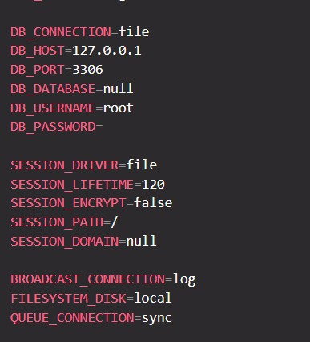
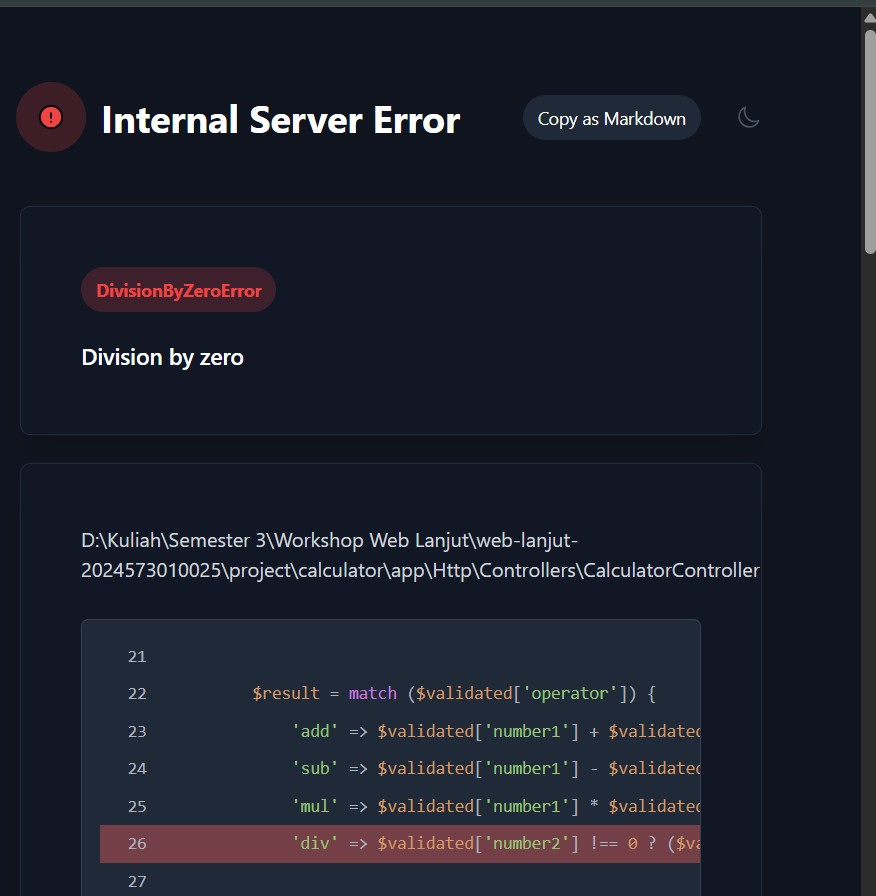

# Laporan Modul 2: Laravel Fundamentasl
**Mata Kuliah:** Workshop Web Lanjut   
**Nama:** [Imam Nawawi]  
**NIM:** [2024573010025]  
**Kelas:** [TI-2C]  

---

## Abstrak 
laporan ini berisi Tentang bagaimana membuat kalkulator dan tujuan saya membuat laporan ini , untuk mengedukasikan/ membagikan bagaimana cara membuat kalkulator di php

---

## 1. Dasar Teori
- Model-View-Controller (MVC) adalah sebuah pola desain perangkat lunak yang membagi logika aplikasi menjadi tiga komponen utama: Model (mengelola data dan logika bisnis), View (menampilkan data kepada pengguna), dan Controller (menghubungkan Model dan View serta menangani alur kerja aplikasi).

- Routing di laravel dapat diartikan bagaimana aplikasi merespons request yang masuk. Routing Menetakan URI ke aksi controller atau closure. rout di laravel didefinisikan di file routes/web.php untuk permintaan web dan di routes /api.php untuk route API

- Fungsi middleware Laravel adalah sebagai perantara atau filter yang memproses request HTTP sebelum mencapai logika aplikasi inti (seperti controller), serta dapat memproses response setelah logika dijalankan, sebelum dikirim ke pengguna. Dan beberapa penggunaan umum middleware di laravel adalah (Authentication/aut, Logging, CORS, Input sanitization)

- Laravel menangani request dan response melalui siklus hidup aplikasi yang terstruktur. Permintaan dari pengguna masuk melalui entry point public/index.php, lalu diproses oleh Kernel HTTP yang meneruskan request melalui serangkaian middleware. Akhirnya, request akan menuju routing dan controller yang menentukan logika aplikasi, kemudian controller mengembalikan objek response, yang selanjutnya akan diproses kembali melalui middleware sebelum dikirim ke browser pengguna

- Peran Controller dan View.
    - Controller Mengatur logika aplikasi dan menajdi penghubung antara model(data) dan view(tampilan). Controller menerima request dari user untuk memproses data(seperti mengambil database lewat model)
    
    -View Bagian yang menampilkan data ke pengguna. View berisi kode HTML/CSS/JS , Serta blade yang menerima data dari controller untuk ditamppilkan ke dalam browser

- Fungsi Blade Templating Engine.

    - Blade adalah sistem template bawaan Laravel yang memungkinkan Anda menulis kode PHP di dalam file tampilan dengan sintaks yang lebih rapi dan aman.

    - Menyediakan fitur seperti template inheritance (@extends, @section, @yield), komponen dan partials, loop & conditional (@foreach, @if), dan escaped output ({{ }}) untuk mencegah serangan XSS.

    - Memudahkan pemisahan logika dan tampilan, sehingga kode lebih terstruktur dan mudah dipelihara.
---

## 2. Langkah-Langkah Praktikum
Tuliskan langkah-langkah yang sudah dilakukan, sertakan potongan kode dan screenshot hasil.

2.1 Praktikum 1 – Route, Controller, dan Blade View

- Langkah-Langkah dalam menambahkan code dalam route/web.php
   1. Buka project nya yaitu helo-laravel

   2. Lalutambahkan kode berikut(untuk menambah route pada routes):
      
      isi code dari gambar tersebut yaitu berfungsi sebagai peta rute untuk laravel anda/ routes/web.php yang menentukan URL apa yang tersedia di web-app dan aksi apa yang dijalankan

    - kemudian  buat view mywelcome.blade.php. dengan contoh code nya seperti pada gambar yg ada dibawah:
        
        Code itu untuk menampilkan bagian welcome page(beranda dengan penulisan Welcome to laravel 12 )
           
    - Dan hasil dari outputan di atas , Paeg welcome nya akan menjadi seerti pada gambar berikut: 
        

2.2 Praktikum 2 – Membuat Aplikasi Sederhana "Calculator"

- Buatlah project baru di folder bernama calculator, kemudian setelah sudah di install ke folder calculator, tambahkan route ke routes/web.php dan contoh code nya ada pada gambar berikut:

- Membuat controller CalculatorController. 
    Buat seperti ini pertama buka terminal lebih dahulu dengan code seperti ini:
    "php artisan make:controller CalculatorController"
    lalu buka app/Http/Contollers/CalculatorController dan ubah code nya menjaidi seperti ini:
    

    - Menambahkan code di view calculator.blade.php.
        Pertama buat file di resources/views lalu buat calculator.blade.php
        Setelah itu isikan dengan code seperti ini:
        
        View ini berisi form untuk input user dan menampilkan hasil perhitungan. juga menangani error validasi

    - Hasil dari outputan code di atas  '
        -Halaman beranda nya:
                
        
        -Hasil percobaan calculator
        

Screenshot Hasil:

---

## 3. Hasil dan Pembahasan
Jelaskan apa hasil dari praktikum yang dilakukan.
- Sesuai dengan harapan meskipun banyak problem yang saya tidak terlalu mengerti seperti di env nya menjadi seperti ini:
 
- Apa yang terjadi jika ada input yang salah (misalnya pembagian dengan 0)?
    Maka akan terjadi error seperti  pada gambar ini 
    
- Bagaimana validasi input bekerja di Laravel?
    - Di Laravel, validasi input bekerja dengan cara memeriksa data yang dikirim dari request (misalnya dari form) agar sesuai dengan aturan yang kita tentukan sebelum data diproses atau disimpan.

- Apa peran masing-masing komponen (Route, Controller, View) dalam program yang dibuat?
    1. Route Berfungsi Menjadi “pintu masuk” aplikasi.
    Dan Perannya: Mencocokkan URL/HTTP method yang diminta pengguna (GET, POST, dll.) dengan aksi yang tepat, misalnya memanggil controller tertentu atau langsung menampilkan view.

    Ibarat: Petunjuk jalan yang menentukan ke mana request diarahkan.

2. Controller berfungsi untuk mengolah logika bisnis.

    Perannya: Menerima data dari Route, memvalidasi/olah data (misalnya ambil dari database melalui Model), lalu menyiapkan data untuk dikirim ke View.

    Ibarat: Otak atau “juru masak” yang menyiapkan hidangan sesuai pesanan.

3. View Berfungsi Menampilkan output ke pengguna.

    Perannya: File blade (.blade.php) yang memuat HTML/CSS/JS untuk menyajikan data yang sudah diolah Controller.

    Ibarat: Piring saji yang menampilkan makanan agar enak dilihat.
---

## 4. Kesimpulan

Fitur Lengkap laravel memudahkan user untuk membuat sebuah web dengan adanya fitur seperti  Menyediakan routing, middleware, templating (Blade), ORM Eloquent untuk database, autentikasi, serta sistem artisan command yang mempercepat pengembangan sebuah web.

---

## 5. Referensi
- https://www.everand.com/book/874828246/Laravel-12-Training-Kit-A-Practical-Guide-to-Modern-Web-Development
- https://santrikoding.com/tutorial-laravel-12-2-cara-install-laravel-12

---
